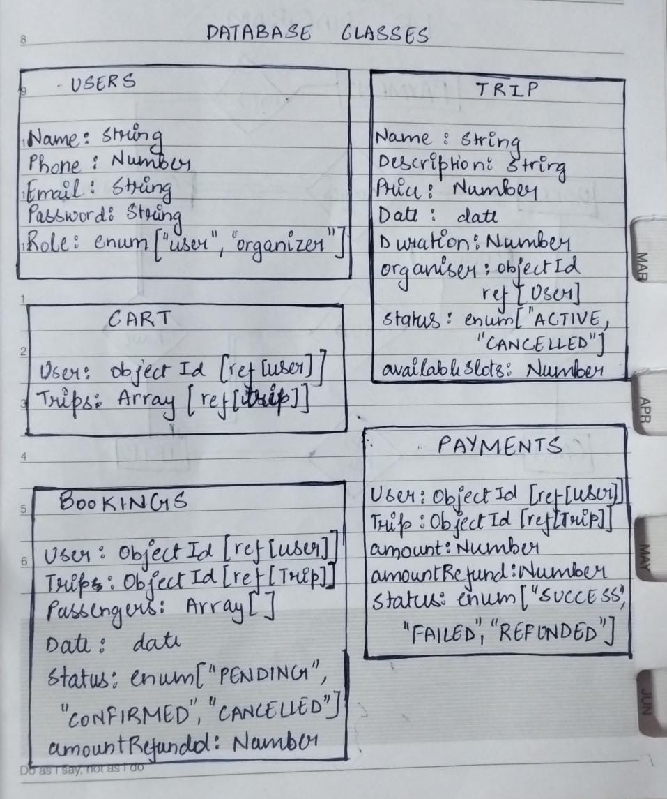
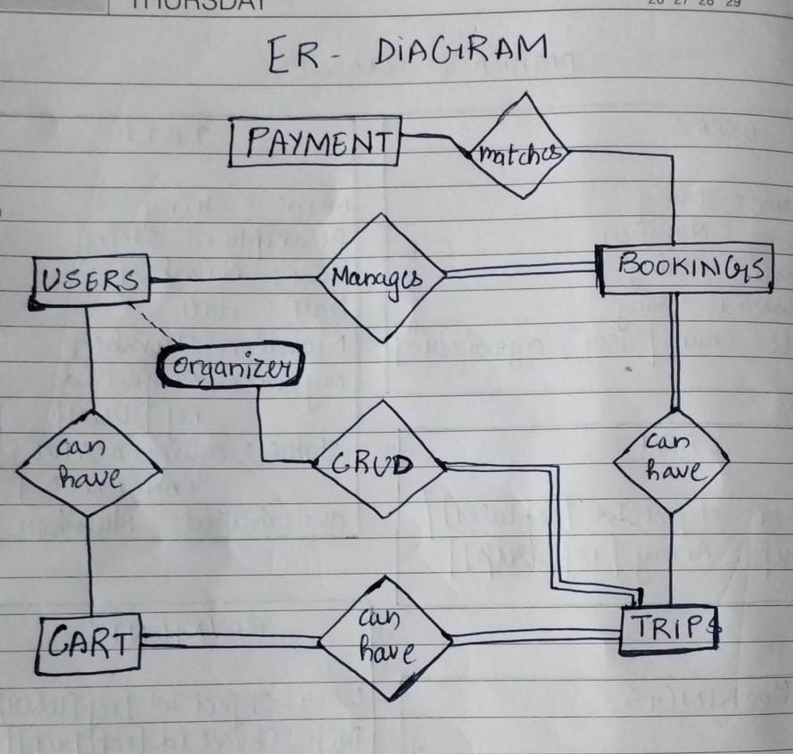
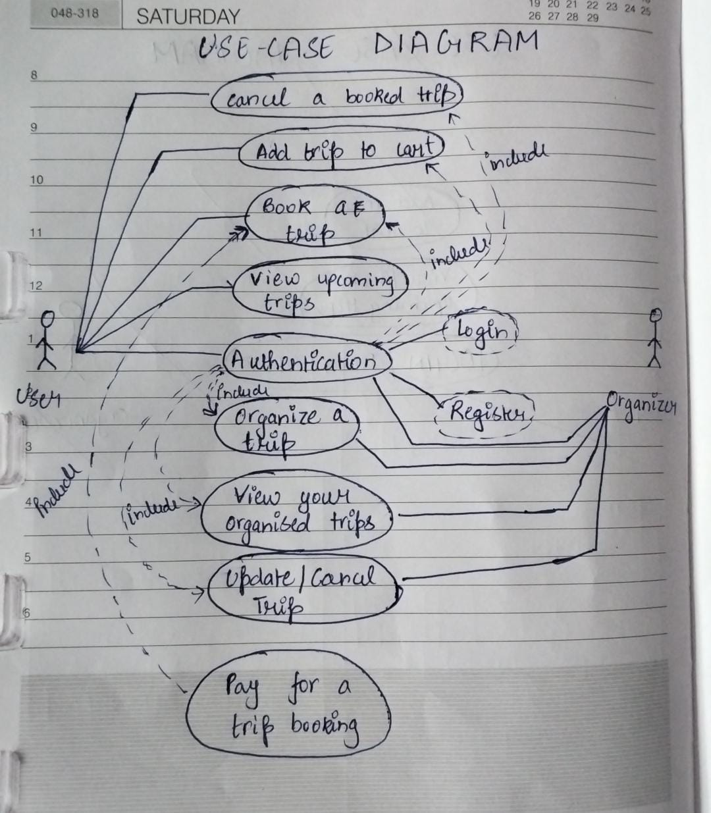
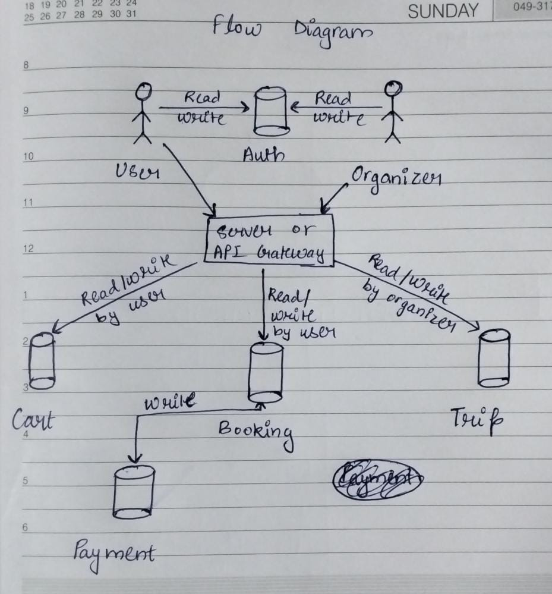

# Travel Application

## Github link (https://github.com/Rishabh324/exploro_travel_assignment)

## Overview

This is a fully functional travel website that allows users to browse, book, and manage trips. Organizers can register, create, and manage trips. The project includes a React frontend and a backend built with your chosen technology stack. This document provides setup instructions, an explanation of the approach, and usage guidelines.

## Features

### Core Functionalities:

1) Trip Listing and Details: Users can view upcoming trips and detailed trip information.
2) Trip Booking: Authenticated users can book trips with a simple checkout process.
3) Authentication: Login and registration for users and organizers.
4) Organizer Dashboard: Organizers can add, edit, and delete trips.
5) Booking Management: Users can view and cancel their bookings based on refund policies.
6) Concurrency handling using optimistic concurrency.

## Setup Instructions

### Prerequisites
Node.js and npm installed.
A database (e.g., MongoDB, PostgreSQL, etc.).
Git for version control.

### Frontend

1) Navigate to the frontend directory
```
cd frontend
```

2) Install Dependencies
```
npm install
```

3) Start dev server
```
npm run dev
```

4) Setup the environment variables by creating '.env' file and adding this variables
```
REACT_APP_BACKEND_URL=http://localhost:5000
```

### Backend

1) Navigate to the frontend directory
```
cd backend
```

2) Install Dependencies
```
npm install
```

3) Setup the environment variables by creating '.env' file and adding this variables
```
PORT=5000
DATABASE_URL=<your-database-url>
JWT_SECRET=<your-secret-key>
DEV_MODE="development"
DATABASE_PASSWORD=<your-database-password>
```

4) Start dev server
```
npm run dev
```

## Approach

These are the various database classes I have considered to be appropriate in my approach.


This diagram here represents the type of relation between the database entities.

-> There is a one-to-one relation between user and cart because each user can have only one cart and one cart should belong to only one user.
-> User(organizer) has a one-to-many relation trip because multiple trips can be organized by one organizer but a single trip is associated with only one organizer.
-> User and Booking classes will have one-to-many relation because a user can perform multiple booking but one booking is done by a user only and trip and booking classes are having the one-to-many relation similarly. 
-> Cart and Trip will be having a many-to-many relation because two or more trips can be related to two or more cart.


This usecase diagram depicts that authentication is necessary for some operation. As you can see that for viewing the upcoming trips we have not included authentication because we want the user to able to see the details about upcoming trips. But to perform any option on that such as booking or adding to cart, we have included the authentication.

Similarly no organizer functionalities will be allowed for non-users therefore we have included authentication on all of them.


This diagram shows that after authentication bothe user and organizer can make some requests on server. As soon as the request arrive on our server, they will be directed to perform the respective operation on the respective databases.

As you can see if a user tries to perform write operation on Bookings database then it is dependent on payments database because if we get the confirmation of payment done from the payments database, then only we will be confirming the booking otherwise the booking will not completed.


## Assumptions

-> Since we are not performing any operation like aggregate, sort, group, etc. operation. Therefore we have estimated the database to be running in linear complexity i.e O(n).